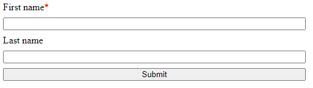

# Form styling

With Formspark you get to bring your own HTML and CSS.

On this page you'll find tips, tricks and links to help you style your forms.

## Simple vertical layout


```html
<!DOCTYPE html>
<html lang="en">
  <head>
    <style>
      .vertical-form {
        display: flex;
        flex-direction: column;
        gap: 0.5rem;
        max-width: 500px;
      }
    </style>
  </head>
  <body>
    <form class="vertical-form" acti<form action="submit_booking.php" method="post">
  <label for="name">Name:</label><br>
  <input type="text" id="name" name="name" required><br><br>
  
  <label for="email">Email:</label><br>
  <input type="email" id="email" name="email" required><br><br>
  
  <label for="phone">Phone number:</label><br>
  <input type="tel" id="phone" name="phone" required><br><br>
  
  <label for="address">Address:</label><br>
  <input type="text" id="address" name="address"><br><br>
  
  <input type="submit" value="Submit">
</form>

</body>
</html>
<h2>Pet Information</h2>
<form action="submit_booking.php" method="post">

  <label for="pet_name">Pet's Name:</label><br>
  <input type="text" id="pet_name" name="pet_name" required><br><br>
  
  <label for="breed">Breed:</label><br>
  <input type="text" id="breed" name="breed"><br><br>
  
  <label for="age">Age:</label><br>
  <input type="number" id="age" name="age" min="0"><br><br>
  
  <label for="weight">Weight (lbs):</label><br>
  <input type="number" id="weight" name="weight" min="0"><br><br>
  
  <label for="special_instructions">Special Instructions:</label><br>
  <textarea id="special_instructions" name="special_instructions" rows="4" cols="50"></textarea><br><br>

  <h2>Service Details</h2>
<form action="submit_booking.php" method="post">

  <label for="service_type">Service Type:</label><br>
  <select id="service_type" name="service_type" required>
    <option value="">Select</option>
    <option value="Grooming">Grooming</option>
    <option value="Nail Trimming">Nail Trimming</option>
    <option value="Bath">Bath</option>

  <label for="appointment_date">Preferred Date:</label><br>
  <input type="date" id="appointment_date" name="appointment_date" required><br><br>

  <label for="appointment_time">Preferred Time:</label><br>
  <input type="time" id="appointment_time" name="appointment_time" required><br><br>

  <label for="special_requests">Special Requests:</label><br>
  <textarea id="special_requests" name="special_requests" rows="2" cols="50"></textarea><br><br>
```

## Add an asterisk to required field labels



```html
<!DOCTYPE html>
<html lang="en">
  <head>
    <style>
      label.required:after {
        content: "*";
        color: red;
      }
    </style>
  </head>
  <body>
    <form action="https://submit-form.com/your-form-id">
      <label for="first-name" class="required">First name</label>
      <input id="first-name" name="first-name" type="text" required />
      <label for="last-name">Last name</label>
      <input id="last-name" name="last-name" type="text" />
      <button type="submit">Submit</button>
    </form>
  </body>
</html>
```

## CSS frameworks

- [Bootstrap](https://getbootstrap.com/)
- [Milligram](https://milligram.io/)
- [Tailwind CSS](https://tailwindcss.com/)
