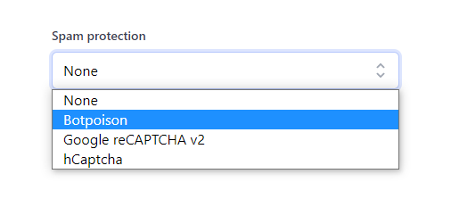

# Spam protection

Every form falls victim to spambots at some point, how you handle them can affect your customers.

Formspark offers the following solutions to prevent spam:

- [Botpoison](https://botpoison.com/) integration
- [reCAPTCHA](https://www.google.com/recaptcha/about/) integration
- [hCaptcha](https://www.hcaptcha.com/) integration
- [Turnstile](https://www.cloudflare.com/products/turnstile/) integration
- [Akismet](https://akismet.com/) integration
- Honeypot technique



Formspark will not save submissions, send notifications or decrement your submission counter if any of the following
conditions are true:

- The submission is empty
- The spam protection verification was unsuccessful
- The submission contains a honeypot

## Botpoison

Formspark integrates with Botpoison, an invisible, user-friendly anti-spam solution.

### Getting started

1. Go to [https://botpoison.com/start/](https://botpoison.com/start/).
2. Create a new configuration.
3. Integrate the `public key` on your
   website ([instructions](https://botpoison.com/documentation/getting-started/html/)).
4. Copy the `secret key`.
5. Open Formspark.
6. In your form's settings, select `Botpoison` under `Spam Protection`.
7. Paste the `secret key` into the `Botpoison secret key` field.

Your form is now protected by Botpoison ✔.

To stop using Botpoison, change your `Spam Protection` to `None`.

### Example

```html
<!DOCTYPE html>
<html lang="en">
  <head>
    <script src="https://unpkg.com/@botpoison/browser" async></script>
  </head>
  <body>
    <form
      method="POST"
      action="https://submit-form.com/your-form-id"
      data-botpoison-public-key="your-botpoison-public-key"
      target="_blank"
    >
      <textarea name="message" placeholder="Message"></textarea>
      <button type="submit">Send</button>
    </form>
  </body>
</html>
```

### AJAX

If you're using AJAX, add the Botpoison response to your submission body via the `_botpoison` property.

```javascript
const body = {
  email: "john.doe@example.com",
  message: "Hello, World!",
  _botpoison: "...",
};
```

### Recommended libraries

- JavaScript: [@botpoison/browser](https://www.npmjs.com/package/@botpoison/browser)

## reCAPTCHA

Formspark integrates with Google's reCAPTCHA v2 "I'm not a robot" checkbox.

### Getting started

1. Go to [https://www.google.com/recaptcha/](https://www.google.com/recaptcha/).
2. Navigate to the admin console.
3. Create a new site.
4. Make sure you select `reCAPTCHA v2`.
5. Make sure you whitelist your website's domain.
6. Integrate the `site key` on your website ([instructions](https://developers.google.com/recaptcha/docs/display)).
7. Copy the `secret` key.
8. Open Formspark.
9. In your form's settings, select `Google reCAPTCHA v2` under `Spam Protection`.
10. Paste the `secret key` into the `reCAPTCHA v2 secret key` field.

Your form is now protected by reCAPTCHA ✔.

To stop using reCAPTCHA, change your `Captcha provider` to `None`.

### HTML

Make sure your form's `method` attribute is explicitly set to `POST`.

```html
<form method="POST">...</form>
```

### AJAX

If you're using AJAX, add the reCAPTCHA response to your submission body via the `g-recaptcha-response` property.

```javascript
const body = {
  email: "john.doe@example.com",
  message: "Hello, World!",
  "g-recaptcha-response": "...",
};
```

### Recommended libraries

- React: [react-google-recaptcha](https://github.com/dozoisch/react-google-recaptcha)

### Articles

- [How to enable your submit button based on reCAPTCHA results](https://technotrampoline.com/articles/how-to-enable-your-submit-button-based-on-recaptcha-results/)

## hCaptcha

Formspark integrates with hCaptcha, an independent alternative to Google's reCAPTCHA.

### Getting started

1. Go to [https://www.hcaptcha.com/](https://www.hcaptcha.com/).
2. Create a new site.
3. Integrate the `site key` on your
   website ([instructions](https://docs.hcaptcha.com/#add-the-hcaptcha-widget-to-your-webpage)). You can find your site
   key [here](https://dashboard.hcaptcha.com/sites).
4. Copy the `secret key`. You can find your secret key [here](https://dashboard.hcaptcha.com/settings).
5. In your form's settings, select `hCaptcha` under `Spam Protection`.
6. Paste the `secret key` into the `hCaptcha secret key` field.

Your form is now protected by hCaptcha ✔.

To stop using hCaptcha, change your `Spam Protection` to `None`.

### HTML

Make sure your form's `method` attribute is explicitly set to `POST`.

```html
<form method="POST">...</form>
```

### AJAX

If you're using AJAX, add the hCAPTCHA response to your submission body via the `h-captcha-response` property.

```javascript
const body = {
  email: "john.doe@example.com",
  message: "Hello, World!",
  "h-captcha-response": "...",
};
```

### Recommended libraries

- React: [react-hcaptcha](https://github.com/hCaptcha/react-hcaptcha)

## Turnstile

Formspark integrates with Turnstile, Cloudflare's smart CAPTCHA alternative.

### Getting started

1. Go to [https://www.cloudflare.com/products/turnstile](https://www.cloudflare.com/products/turnstile/).
2. Create a new site.
3. Integrate the `site key` on your
   website ([instructions](https://developers.cloudflare.com/turnstile/get-started/client-side-rendering/)).
4. Copy the `secret key`.
5. In your form's settings, select `Turnstile` under `Spam Protection`.
6. Paste the `secret key` into the `Turnstile secret key` field.

Your form is now protected by Turnstile ✔.

To stop using Turnstile, change your `Spam Protection` to `None`.

### Recommended libraries

- React: [react-turnstile](https://github.com/Le0Developer/react-turnstile)

## Akismet

Formspark integrates with Akismet, a spam filtering service.

This integration requires no additional setup, it is pre-activated for all accounts.

## Honeypot

::: warning
While simple to implement, this technique is not the most effective.
:::

The honeypot technique is a simple-to-implement spam prevention solution.

To enable this feature, add a field with the name `_honeypot` or `_gotcha` to your form and hide it with CSS (see
example below). The submission will be silently ignored when a spam bot enters a value.

```html
<form action="https://submit-form.com/your-form-id">
  <input
    type="checkbox"
    name="_honeypot"
    style="display:none"
    tabindex="-1"
    autocomplete="off"
  />
  <input type="email" name="email" />
  <button type="submit">Subscribe</button>
</form>
```

## Custom honeypot

Instead of using `_honeypot` or `_gotcha`, you can specify your own honeypot name in your form's settings.

```html
<form action="https://submit-form.com/your-form-id">
  <input
    type="checkbox"
    name="Paste your custom honeypot here"
    style="display:none"
    tabindex="-1"
    autocomplete="off"
  />
  <input type="email" name="email" />
  <button type="submit">Subscribe</button>
</form>
```
